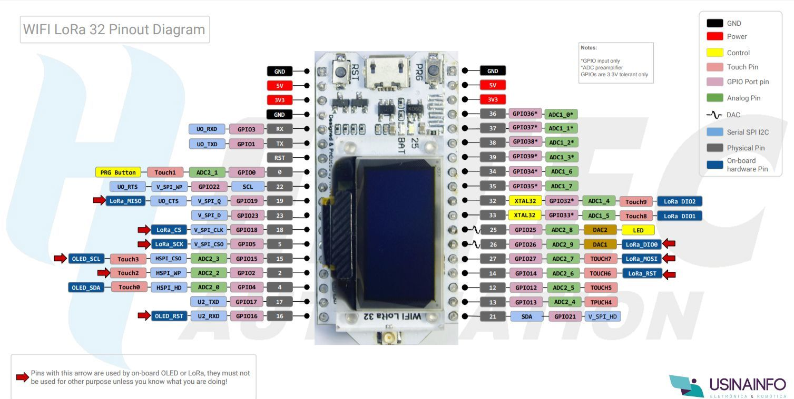

## ESP32 and LoRa


### Cap01, Cap02

[Instituto NCB](http://newtoncbraga.com.br)

[Repositório do livro](https://github.com/phfbertoleti/livro_projetos_esp32_LoRa)

[LoRa Alliance](https://lora-alliance.org/)

[ESP32 Datasheet](https://www.espressif.com/sites/default/files/documentation/esp32_datasheet_en.pdf)

[ESP32 Resources/SDK](https://www.espressif.com/en/products/hardware/esp32/resources)


### Cap03

[WiFi LoRa 32 (V2)](https://heltec.org/project/wifi-lora-32/)

[ESP 32 Overview](https://www.espressif.com/en/products/hardware/esp32/overview)

#### Pinagem WiFi LoRa 32 (v2)


Imagem de [Usina Info](https://www.usinainfo.com.br/blog/esp32-lora-wifi-sx1278/)




**Observações**

* O display OLED usa GPIOs para comunicação I²C distinto do que é configurado por grande parte das
bibliotecas OLED. No Arduino IDE, usar a chamada *Wire.begin(OLED_SDA_PIN, OLED_SCL_PIN);* antes da 
inicialização de qualquer biblioteca de display OLED, usando a I²C correta para o display

* Caso o LoRa não seja usado, não utilizar os GPIOs com funções LoRa: 26, 27, 14, 18, 5 e 19
* Caso o display OLED não seja usado, não utilizar os GPIOs com funções do display: 4 e 15
* **A tensão máxima das entradas analógicas do módulo é de 1,8V**, valores acima disso podem danificar permanentemente o módulo
* **A corrente máxima suportada por um GPIO é de 12mA**, valores acima disso podem danificar permanentemente o módulo
* **GPIOs configurados como input suportam tensão máxima de 3,3V**, valores acima disso podem danificar permanentemente o módulo
* Segundo recomendações do fabricante, **NÃO LIGUE o módulo com a antena do rádio LoRa desconectada**

#### Usando o Arduino IDE

Baixe a versão mais recente [IDE](https://www.arduino.cc/en/main/software)

**Bibliotecas ESP32**

No IDE selecione **File > Preferences**, clique no botão **Additional Boards Manage URls**, na nova janela coloque no campo
"Enter addtional URLs, one for each row" o endereço: https://dl.espressif.com/dl/package_esp32_index.json, clique em OK.

Clique em OK novamente, depois vá em **Tools > Board > Boards Manager...**, busque por "esp32" (sem aspas)

Clique na opção **esp32 by Espressif Systems** e depois no botão **Install**


**Bibliotecas de LoRa e display OLED**

O autor do livro indica um link do datasheet para baixar a biblioteca, muito confuso e decepcionante tal falta de cuidado essencial com a didática. Segui as instruções da própria Heltec [Download the Heltec ESP32 Library](https://docs.heltec.cn/#/en/user_manual/how_to_install_esp32_Arduino?id=step2-download-the-heltec-esp32-library)


Vá em **Sketch > Include Library > Manage Libraries**, busque por *Heltec ESP32* e clique em **Install**


Para instalar a biblioteca do display OLED vá em **Sketch > Include Library > Manage Libraries**, busque por *ADAFRUIT SSD1306*
e clique em **Install** e depois em **Install All** para instar todas as dependencias

#### Primeiro programa

Para compilar corretamente  instale o pyserial usando o PIP do Python

```
pip install pyserial
```

Use o programa listado em *cap_03/hello_world_modulo/hello_world_modulo.ino*, selecione 
**Tools > Board > Heltec Wireless Stick**

Escolha a porta também, no meu caso uso Linux: **Tools > Board > /dev/ttyUSB3**


#### Portas e Serial monitor

Por default o upload do código é feito a 921600 bauds, por isso no código de inicialização 
configure a interface serial para 115200 bauds, assim será possivel fazer leituras no Serial Monitor do Arduino IDE

```
/* Funcao setup */
void setup() 
{
    /* inicializa display OLED */
    Wire.begin(4, 15);
    Serial.begin(115200);
```


### Cap04 - Comunicação ponto a ponto com LoRa

Topologias aceitas: ponto-a-ponto e estrela

No ponto-a-ponto comunicação sincrona duplex ou full-duplex


Código do livro não funciona, usar abaixo:

https://github.com/HelTecAutomation/Heltec_ESP32/blob/master/examples/LoRa/LoRaSender/LoRaSender.ino

